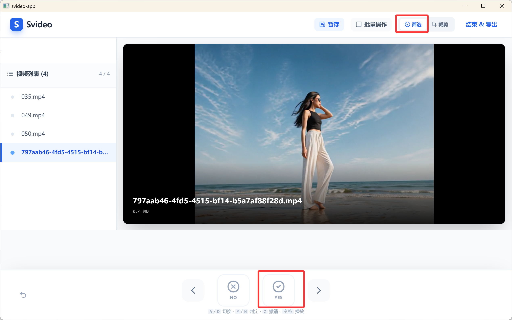
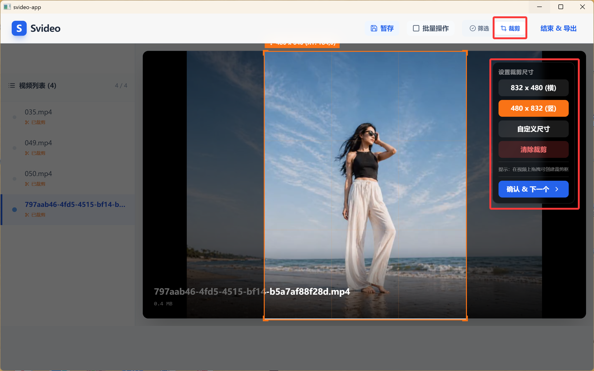

# Svideo — Batch Video Screen and Crop

[](LICENSE)

**English:** A keyboard-driven desktop app for **batch video screening** (keep / discard), **interactive crop regions**, and **FFmpeg-based export** — built with **Electron + React + Vite**. Optimized for creators who need a fast first pass on large folders of footage.

**中文：** 同一套工具完成「批量过片、快捷键筛选、画裁剪框、导出批处理」——适合素材初选与尺寸整理。应用内产品名仍为 **Svideo**。

|  |  |
| --- | --- |
| **Stack** | Electron 25 · React 18 · Vite 4 · Tailwind · FFmpeg (bundled in Windows builds) |
| **Maintainer** | [NKUDZL](https://github.com/NKUDZL) · Deng Zelai · [nkudzl@mail.nankai.edu.cn](mailto:nkudzl@mail.nankai.edu.cn) |
| **License** | [MIT](LICENSE) |

**Suggested GitHub topics (for discovery):** `video` `electron` `ffmpeg` `batch-processing` `video-editing` `screening` `crop` `desktop-app` `windows`

---

## Download (Windows, pre-built)

GitHub 仓库里**不包含**安装包本体（体积大、且会频繁更新）。推荐在 **Releases** 里提供可点击下载的安装包与免安装压缩包。

1. 在 GitHub 创建仓库（例如 **`svideo`**）并推送本代码后，打开 **Releases** → **Draft a new release**。
2. 在本机执行构建（见下文「Build」），在 `svideo-app/dist_electron/` 中会生成例如：
   - **安装版**：`Svideo Setup 1.0.0.exe`（NSIS 安装程序）
   - **免安装 / 解压即用**：`Svideo-1.0.0-win-x64.zip`（名称以 `dist_electron` 下实际文件为准；解压后运行其中的 `Svideo.exe`）
3. 把上述文件 **上传到该 Release 的 Assets**，然后在 README 里使用**固定版本**的直链（把 `v1.0.0` 与文件名换成你实际上传的名称）：

| 类型 | 示例链接（发布时请替换为你的仓库与版本） |
| --- | --- |
| **最新版总览** | [https://github.com/NKUDZL/svideo/releases/latest](https://github.com/NKUDZL/svideo/releases/latest) |
| **便携版 ZIP（示例）** | `https://github.com/NKUDZL/svideo/releases/download/v1.0.0/Svideo-1.0.0-win-x64.zip` |
| **安装程序（示例）** | `https://github.com/NKUDZL/svideo/releases/download/v1.0.0/Svideo%20Setup%201.0.0.exe` |

> **提示：** 若你本地曾用 **RAR** 自己打过「绿色版」包，也可以同样上传到 Releases；直链格式与上表一致，只需把文件名改成实际上传的 `*.rar` / `*.zip`。

---

## Screenshots

| Home | Screening |
| --- | --- |
|  |  |

| Crop | Export |
| --- | --- |
|  |  |

---

## Features

- Import multiple files or a whole folder; common video extensions supported.
- **Filter mode:** mark keep/discard, undo, save progress (`Ctrl+S`).
- **Crop mode:** draw regions, presets & custom sizes; works with your selections for batch export.
- Export filter lists, crop metadata, and FFmpeg-related batch helpers (see in-app options).
- **Windows:** FFmpeg is packaged via `electron-builder` `extraResources`.

---

## Keyboard shortcuts (filtering view)

When screening (not typing in an input):

| Key | Action |
| --- | --- |
| `Y` | Keep |
| `N` | Discard |
| `A` / `←` | Previous |
| `D` / `→` | Next |
| `Z` / `Backspace` | Undo |
| `Space` | Play / Pause |
| `Ctrl+S` | Save progress |
| `Esc` | Close modal |

---

## Development

Requires **Node.js** (LTS recommended) and **npm**.

```bash
cd svideo-app
npm install
npm run electron:dev
```

Web-only (no Electron / limited file & FFmpeg features):

```bash
cd svideo-app
npm install
npm run dev
```

---

## Build

```bash
cd svideo-app
npm run electron:build
```

Artifacts are written to `svideo-app/dist_electron/` (ignored by Git). On Windows you should get both the **NSIS installer** and a **`.zip`** portable archive.

> **macOS:** `package.json` includes a `mac` target, but FFmpeg `extraResources` is currently wired for Windows; mac builds need separate FFmpeg bundling if you ship them.

---

## Repository layout

- Application source: `svideo-app/`
- Root `App.jsx` may diverge from `svideo-app/src/App.jsx` — treat **`svideo-app/src/App.jsx`** as the source of truth.

---

## Push to GitHub

If this folder is not yet connected to a remote:

```bash
cd "d:\vidio diffusion\video_select"
git remote add origin https://github.com/NKUDZL/svideo.git
git branch -M main
git push -u origin main
```

Then publish **Releases** and add the download links above.

---

## Keywords (for search)

video screening, batch review, video crop, electron app, ffmpeg, windows desktop, creator workflow, footage culling, keyboard shortcuts, 视频筛选, 视频裁剪
